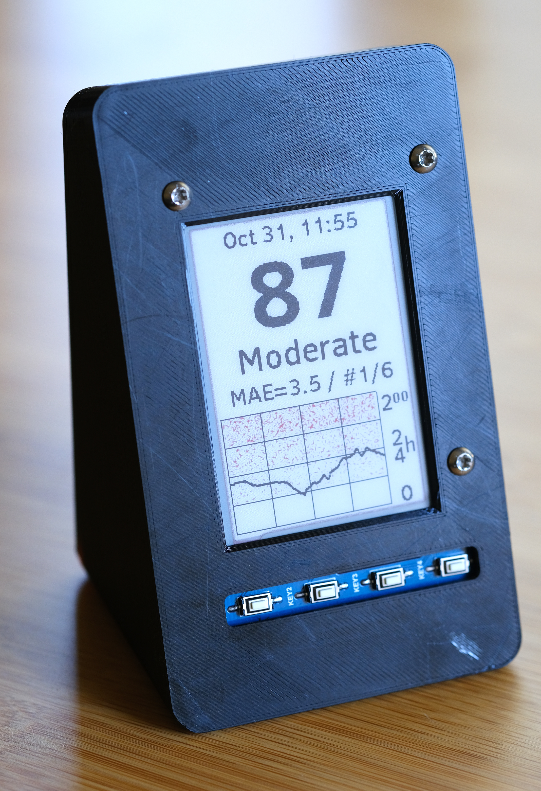
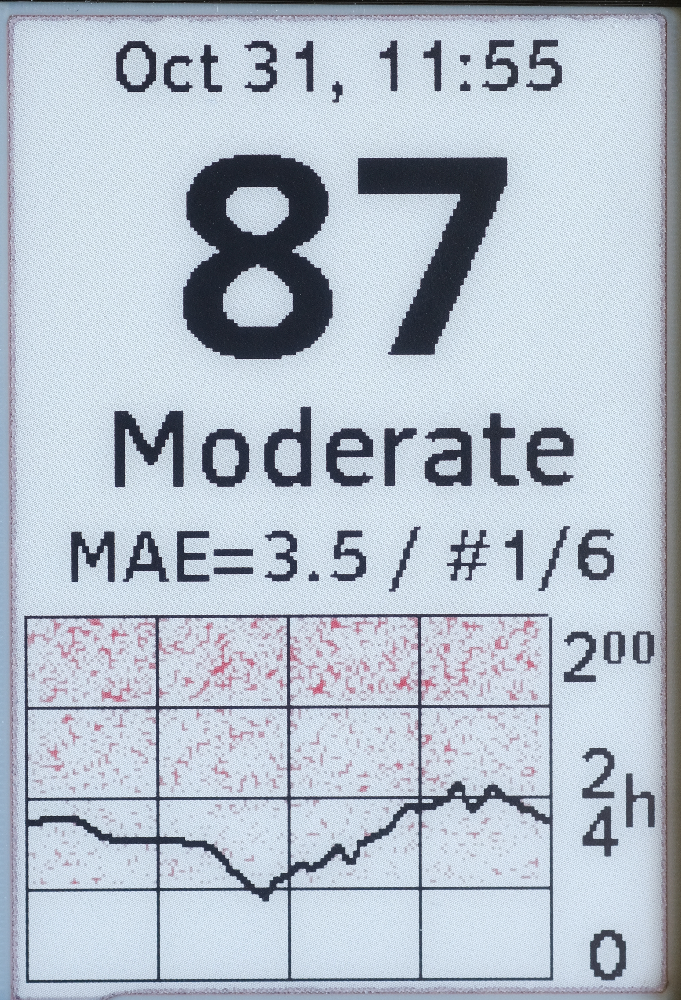

# aaqim = Arduino AQI Monitor

Simple Air Quality Monitor using data collected from the **web** (no local sensor).

Based on an ESP8266 and E-paper display.

  
  

This is not a general, multi-purpose code base, but a quick hack for personal
use.

## Why

The air quality has been a real concern in the West from August 2020.
[Purple Air](https://www.purpleair.com/map) and
[Air Now](https://gispub.epa.gov/airnow/) maps are great tools to evaluate if
you can dare point your nose outside the confine of your shelter or not.
However, I wanted a solution that provides the current state of pollution in a
glimpse, without relying logging on a computer.

Ideally, you would setup your own sensor and create your DIY display to monitor
the pollution in real time. However, due to high demand, air quality sensors are
out of stock everywhere!

The next best option is then to use the data already available. There are more
than 15 Purple Air stations in a 500m diameter circle around my house, so it is
possible to get data localized enough to be relevant. The next requirement for
me was to create a low power solution: I would prefer to not contribute more to
the global warming just for my personal convinience. So a typical solution
relying on a Raspberry Pi single board computer is not considered here.

This project relies on micro-controller with WiFi capabilities to collect other
people sensor data. The display is based on a E-Paper panel that does not
consume current only when it needs to be updated. Since air quality is a slow
evolving parameter, the board and panel are simply stopped between updates,
leading to a very low power solution.

## Details

  - [Some notes on the design](./design.md) (historical data and power consumption)
  - [Hardware related info](./hardware.md) (pinout, etc.)

The STL models for the enclosure are in the `./stls` directory.
The source Fusion-360 model is available with [this link](https://a360.co/31YtSna).
The enclosure holds the Huzzah in place without any screws.

## Bill of Material

Not by design, just un-unsed parts from previous projects:
  - ESP8266 [Adafruit Huzzah](https://www.adafruit.com/product/2821)
    - This was before I selected SAMD21 boards instead. Still, the ESP8266 seems
      a interesting solution for super low cost projects.
  - [2.7in 3 colors E-paper Dislay](https://www.waveshare.com/product/displays/e-paper/epaper-2/2.7inch-e-paper-hat-b.htm)
    - I was initially attracted by the Black + Red capabilities of the panel,
    but refresh time was too slow (~20s) for ultra-low power projects like
    [DigiBaro](https://github.com/flupes/digibaro2/blob/master/README.md).
  - LiPo battery.

## How to build the software

The project is using
[PlatformIO](https://docs.platformio.org/en/latest/home/index.html). I develop
using Visual Studio Code (https://code.visualstudio.com/docs) which play nicely
with the PlatformIo extension.

Several of the unit test are also runnable on the native platform (Ubuntu 20.04
in my case). However, I configured the build to use a 32 bits architecture.
Since any modern computer will today be `amd64`, you will have to install the 32
bit compatibility packages:

    sudo apt install gcc-multilib g++-multilib

### Dependencies

Some dependencies are pulled using git submodules. Get them with:

    git submodule init
    git submodule update
    cd lib # symlink to avoid building the full waveshare source tree
    ln -s ../externals/ePaperDisplay/Arduino/epd2in7b epd2in7b

This includes the e-Paper driver from WaveShare and a fork of the great Adafruit GFX library.

Other "normal" dependencies are installed with PlatformIO:
  - ArduinoJson + StreamUtils from bblanchon

